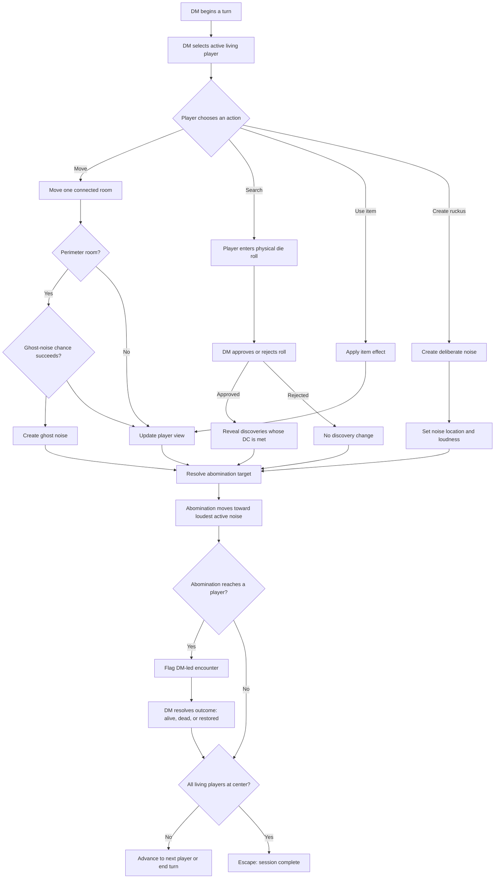
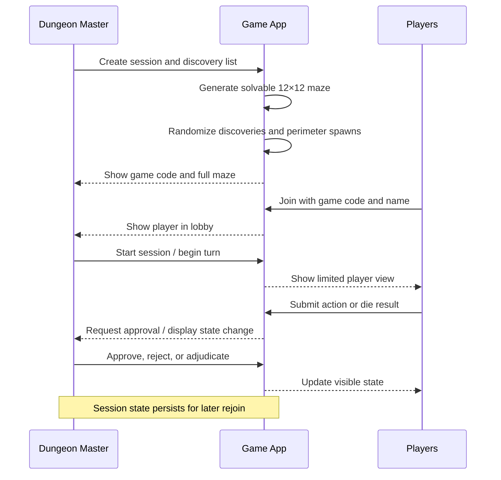
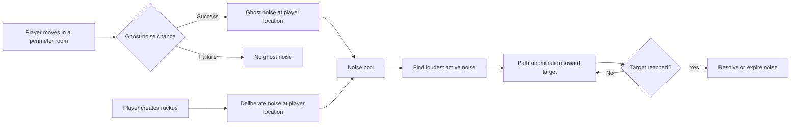

# Maze of Whispers — Game Design Plan

## Vision

**Maze of Whispers** is a browser-based companion for a live tabletop dungeon-crawl. A Dungeon Master (DM) runs a shared game session from a full-control dashboard while players join from their own phones or browsers. The app manages the maze, turns, visibility, discoveries, noise, and the abomination's movement; the DM retains narrative and combat authority.

The party is scattered across the perimeter of a 12×12 maze. They must reunite and reach a central escape hole while avoiding an abomination that hunts the loudest sound. Moving through perimeter rooms may awaken ghosts in the concrete exterior lattice, producing noise that can draw the creature toward a player—or away from an endangered teammate.

## Product Principles

- **DM-led, not rules-replacing.** The app tracks game state; the DM adjudicates roleplay, combat, and consequences.
- **Tense but readable.** Players receive only the information their character can plausibly perceive.
- **Fast at the table.** Core actions should be easy to perform on a phone and easy for the DM to approve.
- **Persistent sessions.** A session can be saved, rejoined, and continued later using its game code.

## Roles

### Dungeon Master

The DM creates and resumes sessions, runs turns, sees the full maze and all hidden state, approves rolls, authors room descriptions and discoveries, controls encounters, and resolves player life/death status.

### Player

A player joins a session using its game code and a chosen display name. They submit actions and physical-die results, see a limited room-oriented view, keep an inventory, and may remain represented in the game after death so teammates can find and revive them.

## Core Game Loop

## Session Flow

## Maze and Visibility

- A session begins with a procedurally generated, solvable **12×12** maze.
- The escape hole is located in the central room.
- Players spawn randomly in valid rooms along the maze perimeter.
- Each player normally sees their current room and one room in the direction they face.
- The DM may enable a small discovered-map view for players. It only displays explored rooms and known routes.
- Room content is text-first for the initial release: a DM-authored description, visible exits, visible people/bodies, and found objects.
- A DM-editable maze is a stretch feature; procedural generation is the initial implementation.

## Turn and Action Rules

- The DM controls when turns begin, end, or advance to the next player.
- A living player receives **one action per turn** by default. This will be configuration-ready for future adjustments.
- Initial actions are:
  - Move one connected room
  - Search the current room
  - Use an item
  - Create a deliberate ruckus, if the DM allows it
- Item effects may later grant extra movement, extended vision, a distraction, healing, or other DM-defined effects.

## Noise and the Abomination

- Moving through a perimeter room has a chance to trigger ghost noise from the exterior lattice.
- Noise has at least a location and loudness. The abomination pursues the loudest active noise, enabling players to deliberately distract it.
- Reaching a player creates a DM-led encounter rather than an automatic game-over. The app pauses or clearly flags the player's normal action state until the DM resolves the encounter.
- The DM can mark players alive, dead, or restored. Dead players remain on the map and can be found by teammates.
- Detailed deliberate-ruckus rules and noise duration/decay remain design decisions to finalize before implementation.

## Searching and Discoveries

- Before a session, the DM makes a list of discovery entries: items, messages, environmental clues, and other finds.
- Each entry includes a title, text, type, difficulty class (DC), and optional item effect.
- The app randomly places the discovery entries into maze rooms once, during session creation.
- A player searches their current room, rolls physical dice, and enters the result in the app.
- The DM approves or rejects the submitted roll.
- On an approved roll, the app reveals discoveries in that room whose DC is met. Example DCs: wall writing at 3; a concealed cache behind a loose brick at 10.

## Win Condition

The session completes successfully only when every player is alive and reaches the central escape hole. The intended outcome is collective escape without unresolved combat or dead party members.

## Screens

### DM dashboard

- Full maze map: walls, exit, players, dead bodies, abomination, discoveries, and noise markers
- Turn controller: begin/end turn, select active player, skip action, and resolve encounter
- Player roster: name, connection state, location, life status, submitted rolls, inventory, and visibility modifiers
- Discovery editor: title, body text, type, DC, optional item effect, and quantity
- Noise tools: view active noise, trigger/override ghost noise, set loudness, and make a manual ruckus
- Session tools: save/resume, share game code, and toggle the player discovered-map option

### Player screen

- Join screen for game code and display name
- Current-room card with description, visible exits, people/bodies, and found objects
- Directional view for the current room plus one room ahead
- Optional discovered-map view, when enabled by the DM
- Action controls and physical-roll submission
- Inventory and temporary effects
- Clear indicators for encounters, death, and waiting for DM approval

## Persistence and Safety of State

- Every session has a shareable game code.
- Session state is saved: maze, placements, player locations/statuses, inventory, noise, abomination position, turn state, and content.
- Players may reconnect with the session code and name; the DM can see their connection state.
- The DM is the authoritative controller for game-changing approvals and status changes.

## Delivery Plan

### Phase 1 — Playable core

- Session creation, game codes, lobby, and player joining
- Solvable 12×12 maze generation, random perimeter spawns, central exit
- DM full-map dashboard, player limited view, turn control, player movement
- Persistence and rejoining

### Phase 2 — Threat and encounters

- Perimeter ghost-noise chance and noise loudness
- Abomination pathing toward the loudest active noise
- Deliberate distractions, encounter flagging, and death/restoration state

### Phase 3 — Exploration and content

- Discovery-list editor and randomized placement
- Search workflow, player roll submission, DM approval, DC-based reveals
- Inventory and initial item effects

### Phase 4 — Table usability

- Room descriptions, activity log, reconnect handling, mobile responsiveness, and accessibility

### Stretch goals

- DM-editable maze layout
- Generated room descriptions
- Campaign templates and reusable discovery libraries
- Expanded item-effect system and configurable action counts

## Remaining Rule Decisions

1. How deliberate ruckus works: physical-roll action, item-only ability, or DM-only action.
2. Whether noise remains active for a fixed duration, fades each turn, or expires when reached by the abomination.
3. Whether the first release uses generic item effects or a fixed starter set of built-in item types.
