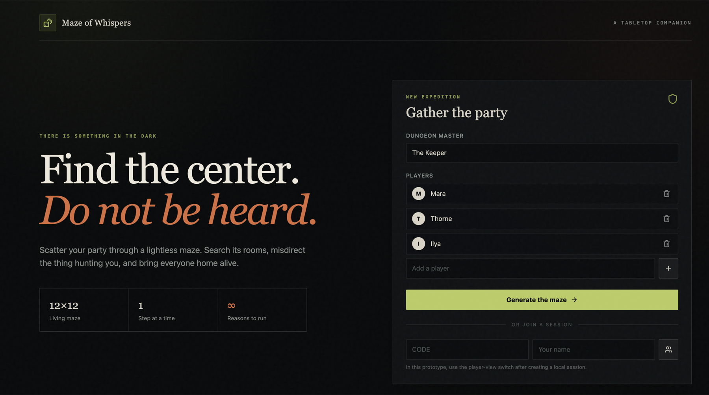
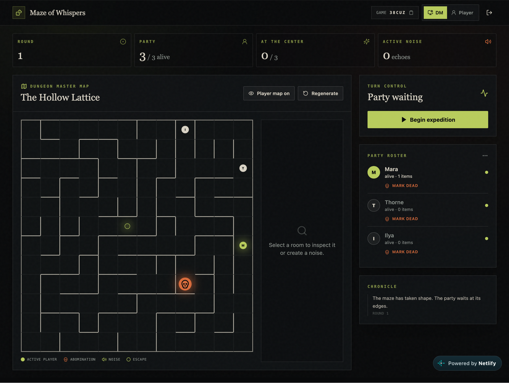
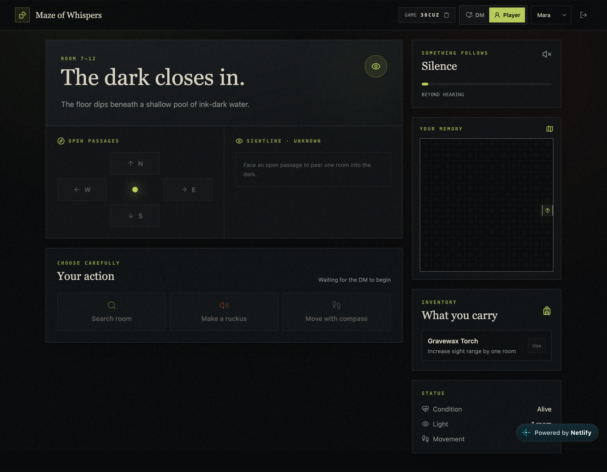

# Maze of Whispers

A Vue 3 and Tailwind tabletop companion for a Dungeon Master running a shared, turn-based maze expedition.

## Play online

[Launch Maze of Whispers](https://incandescent-puppy-119c84.netlify.app/)

## Create and run a game

1. Open the live application.
2. Enter the Dungeon Master's display name.
3. Add each party member by entering their name and selecting **+**. Players can be removed before the maze is generated.
4. Select **Generate the maze**. The app creates a solvable 12×12 maze, places the escape hole, scatters the party around the perimeter, and assigns discoveries.
5. Share the five-character **Live game** code with the players.
6. Each player opens the same application on their own device, enters the game code and their name under **Join a session**, and selects the join button. A matching pre-created party name claims that slot; a new name adds another player at an open perimeter room.
7. Keep the DM dashboard open while joining players are admitted automatically. The roster marks each admitted player as **connected**.
8. Inspect the maze and select **Regenerate** if a different layout is preferred, then select **Begin expedition**.
9. The active player's controls unlock on their device. They can move, search, make a ruckus, or use an item. Physical search and ruckus rolls are entered by the player and approved or rejected from the DM dashboard.
10. After the action and any encounter are resolved, the DM selects **Advance turn**. Continue until every player reaches the center alive.

The DM may use the **Player** tab in the header to preview any party member's limited view. A player browser receives only its own sanitized view; the hidden maze, discoveries, other player locations, and exact abomination location stay in the DM-owned Firestore document.

> Multiplayer requires the Firebase environment variables and the included Firestore Security Rules. When Firebase is unavailable, the application falls back to a browser-local session for development.

## Screenshots

### Create an expedition



### Dungeon Master dashboard



### Player view



## Current prototype

The browser prototype includes:

- A generated, solvable 12×12 maze with extra route loops
- Random perimeter player spawns and a central escape hole
- Full DM map, player roster, turn controls, roll approval, and encounter resolution
- Limited player room/sightline view with an optional explored map
- Physical search and ruckus roll submission
- Randomized discoveries, starter items, inventory, death, and restoration
- Chance-based perimeter ghost noise, fading sound, and abomination pathfinding
- Proximity and direction warnings for players
- Firebase-backed game codes, player joining, realtime actions, and reconnect support
- Responsive DM and phone-sized player interfaces

Game rules and future phases are documented in [GAME_DESIGN.md](./GAME_DESIGN.md).

Firebase project preparation, deployment, and the multiplayer data model are documented in [Firebase and Firestore Setup](./docs/FIREBASE_SETUP.md).

> Firebase must be configured and the included Firestore rules deployed for multi-device sessions. Without Firebase environment variables, the app falls back to the original browser-local prototype.

## Run locally

```bash
npm install
npm run dev
```

Open the local URL printed by Vite. Create an expedition, begin it from the DM dashboard, then use the header role switch to preview each player's screen.

## Quality checks

```bash
npm test
npm run build
```
